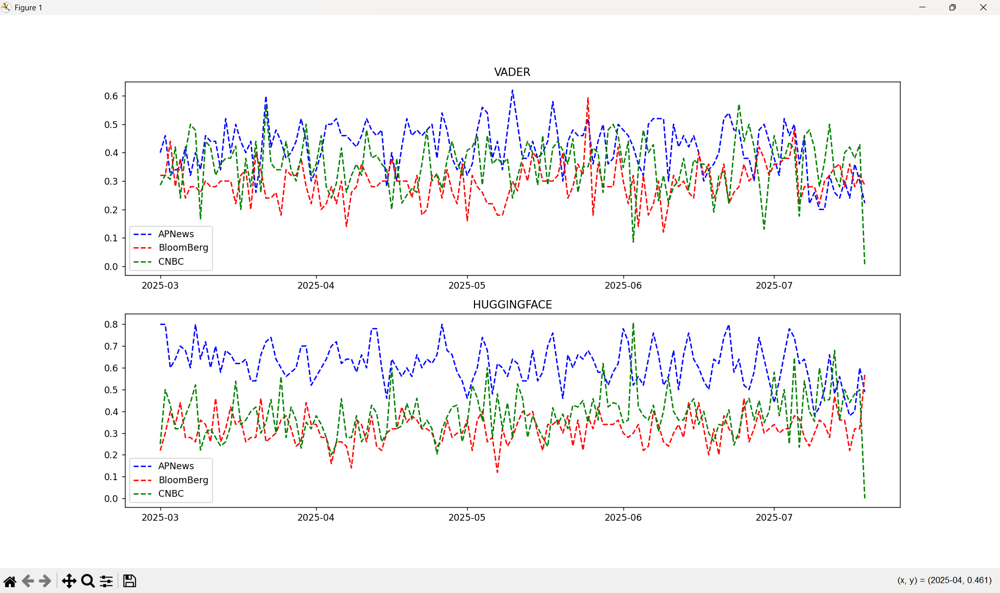

# News Headline Sentiment
A simple news scraper application to scrape the URL and headlines of AP News, Bloomberg, and CNBC news website.
VADER and Hugging Face models are implemented to analysis the sentiment of news over a period of time.

To download data from either of the three news sites until a particular date, run.py has been implemented.
1. Run the command to store the news site code, URL, last modified date, and last extracted date of articles first:

    python `run.py file path` -ws `news code` -ds `start date`

2. Run the command to downlaod 'n' number of news headlines per day:

    python `run.py file path` -ws `news code` -dl `n`

Once the data is downloaded, you can run news_sentiment.py to get the sentiment graph.

Example output:

